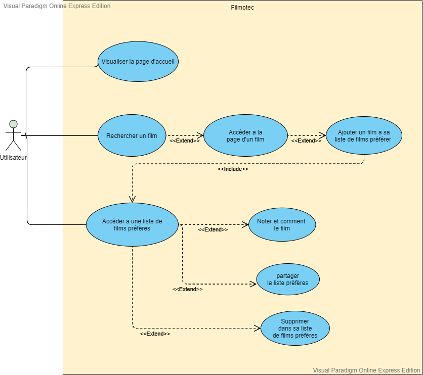
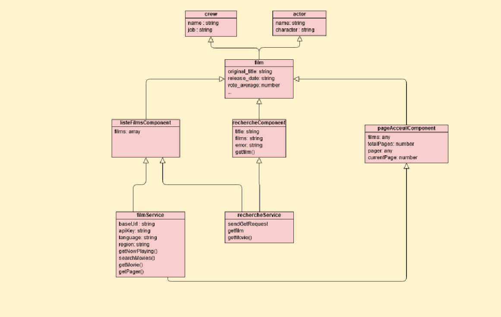
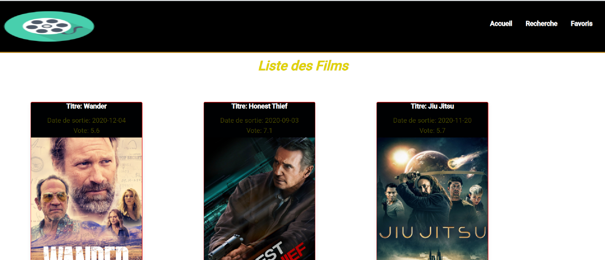
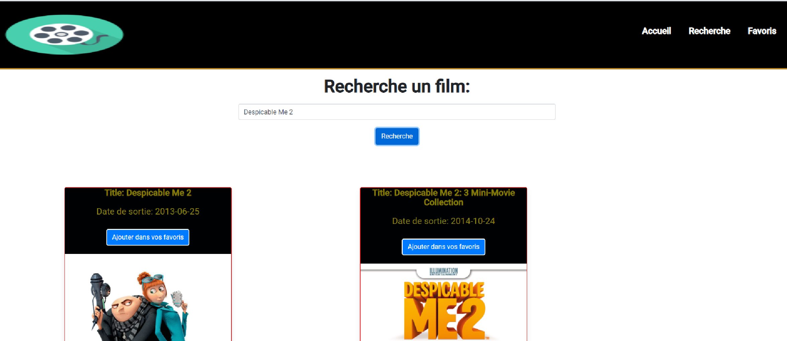

= Filmotec : projet en développement
Doc Writer <doc.writer@asciidoc.org>
v1.0, 2012-01-01

== Présentation

Cette mission repose prioritairement sur le développement d’une application
Frontend avec le framework Angular.

## Contexte

L'application web offer à des utilisateurs une application web leur permettant de gérer une liste de
leurs films préférés. L’utilisateur (le propriétaire) de la filmothèque personnelle évaluera les films
qu’il aura retenus (une évaluation de 1 à 5, avec commentaire)

---
#### Information gérénal
---
[horizontal]
Equipe:: Devcap
Membres:: SAVOUNDIRAPANDIANE Muthuvel / MLIKA BOUKHRIS Nessim / DEMARET Sophie
Langugue de informatique:: TypeScript
IDE:: WebStrom
REST API :: API TMDB
Framework::  Angular /Modéle MVC

== Tâches

* Connexion et exploitation de l’API : Muthuvel et Nessim

* Récupération des données des films : Muthuvel et Nessim

* Mise en page des données : Sophie

* Rapport du projet : Nessim

## Premier partie Analyse

### Cas utilisation

le diagramme est réalise par #Muthuvel#

### Diagramme UML

le diagramme est réalise par #Nessim#

## Présentation de interface du site Filmotec

---

image::src/assets/images/filmotec presentation.2gif.gif[width=800]

## Recherche :

### Présentation et explotation API de TMBD

l'API REST est l'interface de programmation d'application
de transfert d'état REpresentational ou l'API REST.
Cela signifie que lorsqu'une API REST est appelée, le serveur transférer a représentation des ressources demandées Etat au système client.

Le fichier environment.ts se trouver dans le dossier environments

Pour ce connecter l’application à l’api,deux constantes d’environnements sont mises en place :

* apiKey est la clé permettant l’usage de l’api.
* baseUrl est le lien qui sera utilisé comme base pour les requêtes.

----
apiKey: 'b965b85eded21527a91c5b7487bb8dfe',
baseURL: 'https://api.themoviedb.org/3/',
----

Pour afficher une liste de films dans la page d'accueil, j'ai creer un tableau des films et puis on ajoute tous les films envoyes par l'api l'aide d'une methode _getMovie()_.

----
import { Component, OnInit } from '@angular/core';
import { FilmService } from '../../Services/FilmService';

export class ListesFilmsComponent implements OnInit {

  films = [];
  constructor(private FilmService2 : FilmService) { }

  ngOnInit(): void {
    this.FilmService2.getMovie()
    .then(response => this.films = response.results);
  }

----
Ensuite on fait parcourir ce tableau des films dans une boulce _for_.

----
<section class="d-flex flex-wrap">

Titre: {{film.original_title}}

Date de sortie: {{film.release_date}}

Vote: {{film.vote_average}}

</section>
----
----
  getMovie() {
    return fetch(
      environment.baseURL + 'discover/movie?api_key=' + environment.apiKey
    ).then(response => response.json());
  }
----
La methode _getMovie()_ qui la donne en format JSON par la methode fetch qui en parameter d'un url de l'api.

---

### Pour faire une recherche :

explique le code // nessim

----

  constructor(private FilmService: FilmService, private rechercheFilmService: rechercheFilmService) { }

  getFilm(title: string) {
    this.rechercheFilmService.getfilm(title)
      .then(response => this.films = response.results);
  }

----

La méthode getFilm dans rechercheService permet de structurer le lien de la requête que l’application utilisera pour rechercher un film demandé dans le formulaire de recherche par l’utilisateur.

